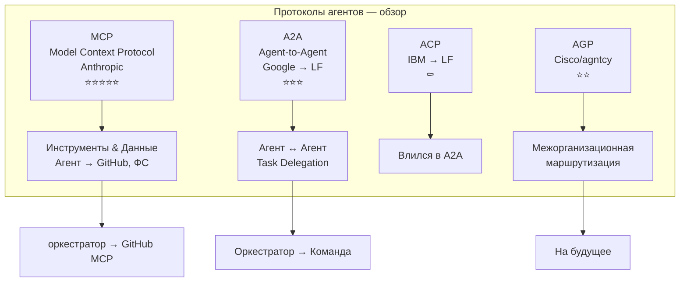
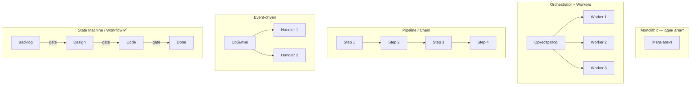
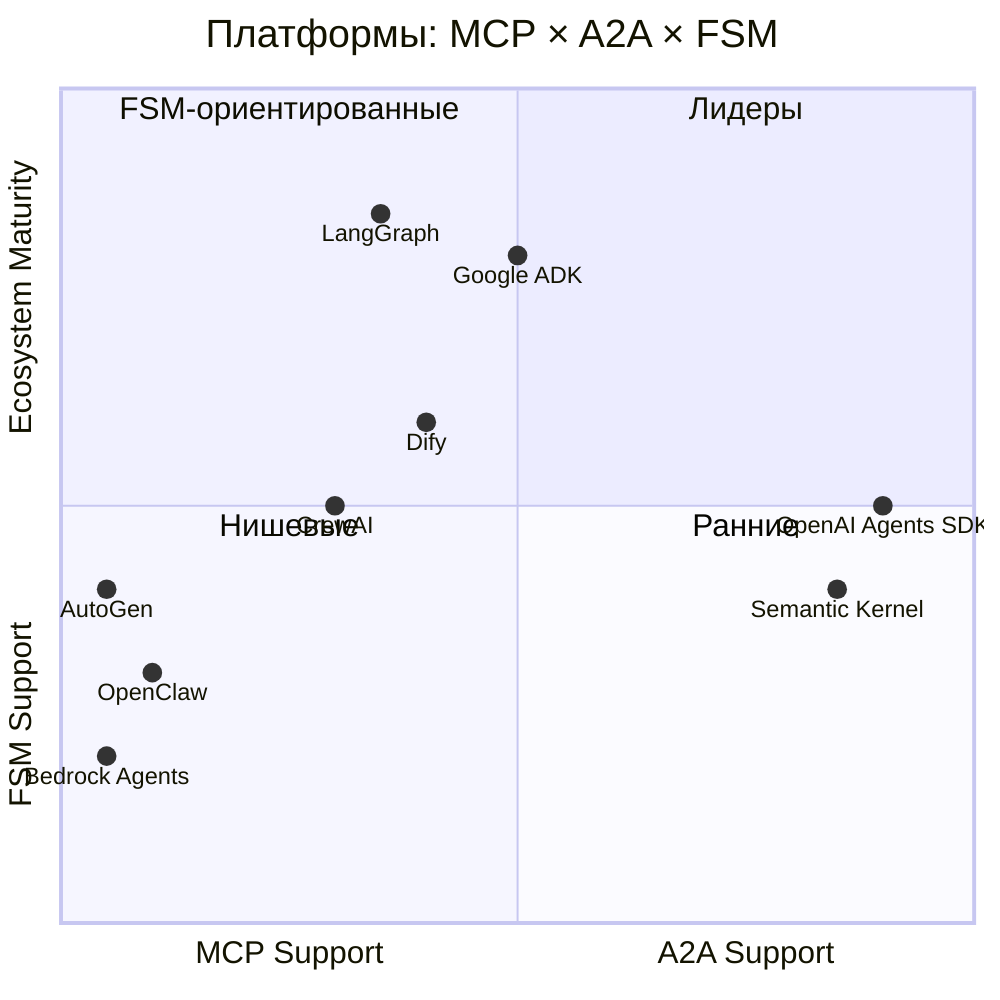
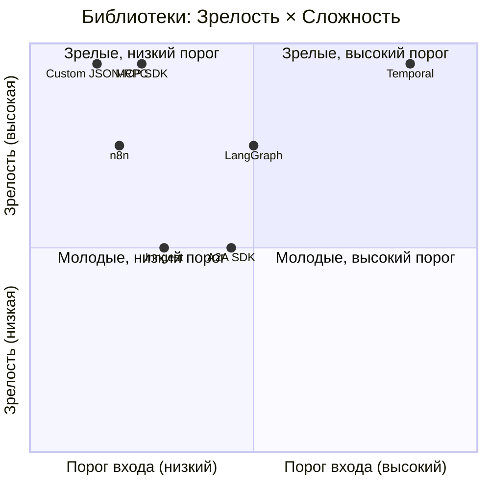
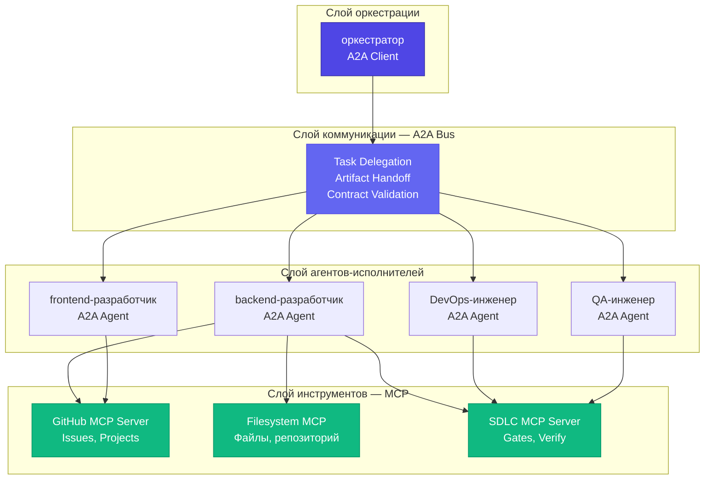

# Архитектура агентов Veai на базе MCP + A2A

> Версия 2.0 — 08.06.2026  
> Статус: Draft  

---

## 1. Проблема

SDLC формализован в документация процесса + bash-скрипты (CLI-скрипты управления бордом, скрипт верификации, gatekeeper в CLI-скрипты управления бордом). Это самодельное решение с рядом проблем:

- **Gatekeeper на bash** — хрупкий, сложно расширять, нет типизации
- **Верификаторы на grep/python** — проверяют текст, не контракты
- **Контекст между агентами** — теряется, агенты не знают что предыдущий сделал
- **Нет стандартизации** — каждый агент имплементирует свою логику перехода
- **Фантомный Done** — артефакты не проверяются автоматически при передаче фазы

Индустрия уже стандартизировала протоколы для этого. Попытка написать HTTP своими руками избыточна.


*Источник: xkcd #303 «Compiling» (CC BY-NC 2.5)*

## 2. Протоколы

### 2.1 MCP (Model Context Protocol) — Anthropic

**Назначение:** Агент ↔ Инструменты/Данные

**Зрелость:** ⭐⭐⭐⭐⭐ — самый зрелый протокол. Официальные SDK (Python, TypeScript). Широкая индустриальная поддержка.

**Ключевые концепции:**
- **Tools** — действия, которые агент может вызвать (создать issue, обновить борд)
- **Resources** — данные, которые агент может читать (файлы, API-ответы)
- **Prompts** — шаблоны поведения

**Что покрывает для нас:**
- GitHub MCP Server (официальный) — CRUD issues, Projects V2, PR, Actions
- Заменяет: CLI-скрипты управления бордом, 
- Заменяет: прямые `gh api graphql` вызовы
- Заменяет: кэш `локальный кэш` (MCP server управляет кэшированием)

**Token-затраты:** ~150K токенов на загрузку всех tool definitions (по данным Anthropic). Решение: загружать только нужные toolset-ы.

### 2.2 A2A (Agent-to-Agent) — Google → Linux Foundation

**Назначение:** Агент ↔ Агент

**Зрелость:** ⭐⭐⭐ — спецификация стабильна, референс-имплементации есть, но экосистема молодая.

**Ключевые концепции:**
- **Agent Card** — JSON-описание возможностей агента (навыки, протоколы,端点)
- **Task** — единица работы, передаваемая между агентами
- **Message** — коммуникация внутри Task (артефакты, статус, вопросы)
- **Push Notifications** — асинхронные уведомления о завершении

**Что покрывает для нас:**
- Передача артефактов между фазами SDLC (Planning → Design → Implementation → ...)
- Контракты: обязательные поля в Task payload = gatekeeper без bash
- Оркестрация: оркестратор как client agent, команда как remote agents
- Заменяет: gatekeeper в CLI-скрипты управления бордом (проверка обязательных полей до передачи)
- Заменяет: систему событий OpenClaw (частично)

**Коммуникация:** JSON-RPC over HTTP/SSE — стандартные веб-технологии.

### 2.3 ACP (Agent Communication Protocol) — IBM → Linux Foundation

**Статус:** ⚠️ ACP официально влился в A2A. Не отдельный протокол.

ACP был REST-based альтернативой A2A (без JSON-RPC, проще). Сейчас его концепции интегрированы в A2A. Отдельно реализовывать нет смысла.

### 2.4 AGP (Agent Gateway Protocol) — Cisco/agntcy

**Назначение:** Иерархическая маршрутизация между агентами (надстройка над A2A)

**Зрелость:** ⭐⭐ — спецификация draft, референс-имплементация минимальная

**Применение:** Пока рано. AGP решает проблему масштабирования (тысячи агентов, межорганизационное взаимодействие). 15 агентов — A2A достаточно.

**На будущее:** Если Veai Control (система мониторинга агентов) будет мониторить агенты разных организаций — AGP станет актуален.

### Сравнение протоколов — визуальная схема



## 3. Архитектуры взаимодействия — сравнение паттернов

Прежде чем выбирать протоколы, нужно понять **как** агенты координируются. Архитектура взаимодействия — это паттерн, определяющий кто кому говорит, когда и что. От выбора паттерна зависит всё остальное.

### 3.1 Monolithic — один агент делает всё

```
┌──────────────────────────────┐
│         Мега-агент          │
│  планирует + пишет + тести  │
│  рулит + деплоит + пишет    │
└──────────────────────────────┘
```

**Как работает:** Одна LLM-сессия получает задачу и выполняет все шаги сама — от анализа до деплоя. Контекст один, память одна, ошибок коммуникации нет.

**Плюсы:** Простой. Нет проблем с передачей контекста. Нет оверхеда на координацию.
**Минусы:** Контекстное окно переполняется. Токены горят на каждый шаг. Ошибка на одном этапе ломает всё. Не масштабируется.

**Когда подходит:** Прототипы, разовые задачи, simple scripts. ChatGPT с плагинами — типичный monolithic.
**Когда нет:** Любой процесс из 3+ фаз с разными ролями.

### 3.2 Orchestrator + Workers — менеджер + исполнители

```
        ┌─────────────┐
        │  Оркестратор │
        └──┬──┬──┬──┬─┘
           │  │  │  │
        ┌──┘  │  │  └──┐
        ▼     ▼  ▼     ▼
      [backend-разработчик][frontend-разработчик][DevOps-инженер][QA-инженер]
```

**Как работает:** Центральный агент (менеджер) получает задачу, разбивает, делегирует исполнителям, собирает результаты, проверяет.

**Плюсы:** Чёткая ответственность. Контекст изолирован. Можно менять исполнителей.
**Минусы:** Оркестратор — SPOF. Токены тратятся на координацию, не на работу. Если менеджер «засыпает» — всё стоит.

**Когда подходит:** Команды с ролями, SDLC-процессы. оркестратор + исполнители (пример: OpenClaw).
**Когда нет:** Когда менеджер не справляется с потоком ( >10 одновременных задач).

### 3.3 Pipeline/Chain — последовательная передача

```
[BA] → [Дизайнер] → [Разработчик] → [QA] → [Деплой]
  │        │            │          │        │
  ▼        ▼            ▼          ▼        ▼
 reqs    design       code      verdict  release
```

**Как работает:** Агенты выстроены в цепочку. Выход одного = вход следующего. Никто не прыгает через этап.

**Плюсы:** Предсказуемый порядок. Легко аудировать. Естественное соответствие SDLC.
**Минусы:** Нет параллелизма. Если один агент застрял — весь конвейер стоит. Нет ветвления.

**Когда подходит:** Линейные процессы (SDLC). LangChain Chains — типичный pipeline.
**Когда нет:** Когда задачи требуют параллельной работы или условного ветвления.

### 3.4 Event-driven — реакция на события

```
  [GitHub webhook] ──→ [Агент-обработчик]
  [Крон heartbeat] ──→ [Агент-проверщик]
  [PR создан]     ──→ [Агент-ревьюер]
```

**Как работает:** Агенты не вызываются напрямую — они подписаны на события и реагируют когда что-то происходит.

**Плюсы:** Слабая связанность. Легко добавлять новых слушателей. Работает асинхронно.
**Минусы:** Сложно отладить (кто на что подписан?). Нет гарантии порядка. События могут теряться.

**Когда подходит:** Мониторинг, алерты, реактивные проверки. cron-задачи (пример: OpenClaw) — event-driven.
**Когда нет:** Когда важен строгий порядок и гарантии доставки.

### 3.5 Swarm/Mesh — децентрализованная координация

```
     [Агент A] ⇄ [Агент B]
        ⇕           ⇕
     [Агент C] ⇄ [Агент D]
```

**Как работает:** Агенты общаются друг с другом напрямую. Нет единого оркестратора. Решения принимаются коллективно.

**Плюсы:** Нет SPOF. Устойчив к сбоям. Агенты адаптируются.
**Минусы:** Непредсказуемость. Токены тратятся на «обсуждение». Может зациклиться. Нет гарантии результата.

**Когда подходит:** Brainstorming, exploration, research. AutoGen group chat — swarm.
**Когда нет:** Продакшн-процессы с жёсткими правилами. Команда Forge — точно нет.

### 3.6 Hierarchical — дерево оркестраторов

```
           [Главный менеджер]
          ┌──────┴──────┐
     [Отряд A]      [Отряд B]
     ┌──┴──┐        ┌──┴──┐
   [А1] [А2]     [B1] [B2]
```

**Как работает:** Менеджеры делегируют подменеджерам, те — исполнителям. Иерархия как в компании.

**Плюсы:** Масштабируется. Каждый уровень управляет своей областью. Чёткие зоны ответственности.
**Минусы:** Задержка на каждом уровне. Токены тратятся на коммуникацию между уровнями. Сложно координировать кросс-отрядные задачи.

**Когда подходит:** Большие команды ( >10 агентов) с разными доменами. CrewAI с менеджерами — hierarchical.
**Когда нет:** Маленькие команды, кросс-функциональные задачи.

### 3.7 State Machine / Workflow — формальный FSM

```
Backlog → Requirements → Design → Implementation → Review → QA → Deploy → Done
   │         │            │          │             │       │      │
   └──[gate]─┘──[gate]───┘──[gate]──┘──[gate]────┘──[gate]─┘──[gate]─→ Done
```

**Как работает:** Процесс описан как конечный автомат. Переходы между состояниями — детерминистические. Guards (условия перехода) — код, не LLM.

**Плюсы:** 100% воспроизводимость. Ноль токенов на оркестрацию. Невозможно нарушить процесс. Легко тестировать.
**Минусы:** Жёсткость — нельзя «подправить на ходу». Требует upfront-проектирования. Не подходит для творческих задач.

**Когда подходит:** SDLC, compliance, продакшн-процессы. LangGraph, Temporal — state machines.
**Когда нет:** Исследования, брейнштормы, задачи без чёткого процесса.

### Визуальное сравнение паттернов



### Сравнительная таблица

| Паттерн | Токены на координацию | Воспроизводимость | Масштабируемость | Сложность внедрения |
|---------|----------------------|-------------------|-----------------|-------------------|
| Monolithic | Высокие | Низкая | Нет | Низкая |
| Orchestrator+Workers | Высокие | Средняя | Средняя | Средняя |
| Pipeline | Средние | Высокая | Нет | Низкая |
| Event-driven | Низкие | Низкая | Высокая | Средняя |
| Swarm/Mesh | Очень высокие | Очень низкая | Высокая | Низкая |
| Hierarchical | Высокие | Средняя | Высокая | Высокая |
| **State Machine** | **Нулевые** | **100%** | **Средняя** | **Средняя** |

### Вывод для Forge

Рекомендуется **State Machine** для оркестрации (переходы между фазами — детерминистические guards) + **Orchestrator+Workers** для исполнения (менеджер делегирует агентам). Pipeline не даёт параллелизма. Swarm — хаос. Monolithic — не масштабируется.

Именно эту комбинацию описывается дальше.


*Источник: xkcd #1319 «Automation» (CC BY-NC 2.5)*

## 4. Платформы и фреймворки — кто что поддерживает

Протоколы — это стандарты. Но кто их реализует? Ни одна платформа не даёт MCP + A2A + FSM из коробки.

### 4.1 OpenClaw

**Что:** Open-source runtime для AI-агентов. Telegram-интерфейс, sessions_spawn, systemEvent, cron.

**MCP:** Нет нативной поддержки. Агенты вызывают инструменты через shell-команды.
**A2A:** Нет. Агенты могут общаться через sessions_send (proprietary transport).
**FSM/Workflow:** Нет. Процесс — в голове менеджера или в bash-скриптах.

**Для чего подходит:** Коммуникация (Telegram → агент → человек), спавн агентов, heartbeat-мониторинг.
**Ограничения:** Нет контрактования. Нет типизации. Процесс полностью на усмотрение LLM.

### 4.2 CrewAI

**Что:** Python-фреймворк. Роли, задачи, процессы (sequential/hierarchical).

**MCP:** Через интеграцию с LangChain tools. Не нативно.
**A2A:** Нет.
**FSM/Workflow:** Процесс = sequential или hierarchical. Не формальный FSM.

**Для чего подходит:** Быстрое прототипирование мультиагентных команд. Research, writing, analysis.
**Ограничения:** Python-only. Нет persistence. Нет гарантий выполнения процесса.

### 4.3 AutoGen

**Что:** Microsoft. Multi-agent conversation. Group chat.

**MCP:** Нет нативно.
**A2A:** Нет.
**FSM/Workflow:** Нет.

**Для чего подходит:** Исследования, brainstorming, диалоговые задачи.
**Ограничения:** Агенты болтают, а не работают. Нет enforcement. Нет persistence.

### 4.4 LangGraph

**Что:** LangChain-экосистема. Направленный граф состояний. Conditional edges, cycles.

**MCP:** Через LangChain tool calling.
**A2A:** Нет.
**FSM/Workflow:** Да — это основная абстракция. Nodes = функции, edges = переходы.

**Для чего подходит:** Workflow с условиями, циклами, human-in-the-loop. SDLC как state graph.
**Ограничения:** Python-only. Привязка к LangChain. State в памяти (нужен checkpointer для persistence).

### 4.5 Dify

**Что:** Визуальный workflow builder. Drag-and-drop, low-code.

**MCP:** Частично — через tool integration.
**A2A:** Нет.
**FSM/Workflow:** Визуальный граф. Условия, ветвления.

**Для чего подходит:** Быстрое прототипирование. Нетехнические пользователи. Простые workflows.
**Ограничения:** Ограниченная кастомизация. Vendor lock-in. Не для сложных процессов.

### 4.6 Semantic Kernel

**Что:** Microsoft. Plugins, planners, memory.

**MCP:** Нативная поддержка MCP connectors.
**A2A:** Нет.
**FSM/Workflow:** Через Process Framework (preview).

**Для чего подходит:** Enterprise .NET/Python. Интеграция с Azure.
**Ограничения:** .NET-first. Heavy enterprise. Не для стартапов.

### 4.7 OpenAI Agents SDK

**Что:** OpenAI. Handoffs, guardrails, tracing.

**MCP:** Да — нативная поддержка MCP servers.
**A2A:** Нет.
**FSM/Workflow:** Handoffs = упрощённая маршрутизация. Не формальный FSM.

**Для чего подходит:** OpenAI-экосистема. Быстрые агенты с guardrails.
**Ограничения:** OpenAI-only. Python. Нет persistence.

### 4.8 Google ADK

**Что:** Google. Agent Development Kit. A2A — первый класс.

**MCP:** Через интеграцию.
**A2A:** Нативно — Agent Cards, Task delegation, artifacts.
**FSM/Workflow:** Частично — через A2A Task lifecycle.

**Для чего подходит:** Мультиагентные системы с контрактами. Будущий стек A2A.
**Ограничения:** Ранний stage. Python-only. Документация скудная.

### 4.9 Amazon Bedrock Agents

**Что:** AWS. Action groups, knowledge bases, guardrails.

**MCP:** Нет.
**A2A:** Нет.
**FSM/Workflow:** Упрощённый — action groups как шаги.

**Для чего подходит:** AWS-экосистема. Enterprise compliance.
**Ограничения:** AWS lock-in. Ограниченная кастомизация. Дорого.

### Визуальная карта платформ



### Сравнительная таблица

| Платформа | MCP | A2A | FSM | Persistence | Открытый исходный код |
|-----------|-----|-----|-----|-------------|---------------------|
| OpenClaw | ❌ | ❌ | ❌ | ❌ | ✅ MIT |
| CrewAI | ⚠️ | ❌ | ⚠️ | ❌ | ✅ MIT |
| AutoGen | ❌ | ❌ | ❌ | ❌ | ✅ MIT |
| LangGraph | ⚠️ | ❌ | ✅ | ⚠️ | ✅ MIT |
| Dify | ⚠️ | ❌ | ⚠️ | ✅ | ⚠️ (open core) |
| Semantic Kernel | ✅ | ❌ | ⚠️ | ✅ | ✅ MIT |
| OpenAI Agents SDK | ✅ | ❌ | ⚠️ | ❌ | ✅ Apache 2.0 |
| **Google ADK** | ⚠️ | **✅** | ⚠️ | ❌ | ✅ Apache 2.0 |
| Bedrock Agents | ❌ | ❌ | ⚠️ | ✅ | ❌ |

### Вывод

Ни одна платформа не покрывает все три слоя (MCP + A2A + FSM). Придётся компоновать: **MCP** — для инструментов, **LangGraph или Temporal** — для workflow, **Google ADK** — для A2A когда понадобится. OpenClaw остаётся слоем коммуникации (Telegram).

## 5. Библиотеки и инструменты реализации

Протоколы выбраны, платформы оценены. На чём писать код?

### 5.1 MCP SDK (Python / TypeScript)

**Зрелость:** ⭐⭐⭐⭐⭐ — официальный SDK от Anthropic. Стабильный, документированный.

**Что даёт:** Server и Client. JSON-RPC transport. Tool/Resource/Prompt registration. Stdio и SSE transport.

**Когда применять:** Любой MCP-сервер. GitHub MCP и SDLC MCP — на нём.
**Когда НЕ применять:** Если нужно агент-агент общение (это A2A, не MCP).

### 5.2 A2A SDK (Python / TypeScript)

**Зрелость:** ⭐⭐⭐ — референс-имплементация от Google. Работает, но документация минимальна.

**Что даёт:** Agent Card, Task, Message, Push Notification. JSON-RPC over HTTP/SSE.

**Когда применять:** Контракты между агентами. Task delegation с обязательными полями.
**Когда НЕ применять:** Если агентов <3 (overkill). Если транспорт уже есть (OpenClaw sessions).

### 5.3 LangGraph

**Зрелость:** ⭐⭐⭐⭐ — часть LangChain-экосистемы. Активно развивается.

**Что даёт:** State graph, conditional edges, cycles, human-in-the-loop, checkpointing (SQLite/Postgres).

**Когда применять:** Workflow с условиями и циклами. SDLC как граф. Human approval steps.
**Когда НЕ применять:** Когда нужен durable execution (при рестарте сервера workflow должен продолжиться). LangGraph checkpointing — не production-grade для этого.

### 5.4 Temporal

**Зрелость:** ⭐⭐⭐⭐⭐ — production-grade workflow engine. Используется в Netflix, Coinbase, Datadog.

**Что даёт:** Durable workflows (переживают рестарт сервера). Retries, timeouts, saga patterns. Go, TypeScript, Python SDK.

**Когда применять:** Продакшн-процессы, где потеря состояния = катастрофа. CI/CD pipelines. SLA enforcement.
**Когда НЕ применять:** Прототипы. Простые линейные процессы. Когда инфраструктура Temporal server — overhead.

### 5.5 n8n

**Зрелость:** ⭐⭐⭐⭐ — визуальный automation platform. 400+ интеграций.

**Что даёт:** Drag-and-drop workflow builder. Webhook triggers. HTTP requests. Code nodes.

**Когда применять:** Быстрое прототипирование интеграций. Нетехнические пользователи. Простые automation.
**Когда НЕ применять:** Сложная бизнес-логика. Продакшн-процессы с гарантиями. Когда нужен код, а не визуальный редактор.

### 5.6 Inngest

**Зрелость:** ⭐⭐⭐ — event-driven functions platform. TypeScript-first.

**Что даёт:** Event triggers, durable functions, retries, concurrency control.

**Когда применять:** Event-driven архитектуры. Serverless. Когда нужно реагировать на события.
**Когда НЕ применять:** Когда важен синхронный workflow. Когда нет TypeScript.

### 5.7 Custom JSON-RPC

**Зрелость:** ⭐⭐⭐⭐⭐ — это не библиотека, это подход. Пишешь свой протокол поверх JSON-RPC.

**Что даёт:** Полный контроль. Минимальные зависимости. Можно реализовать за вечер.

**Когда применять:** Когда стандарты (MCP, A2A) — overhead. Когда нужно быстро. Когда команды 3-5 агентов.
**Когда НЕ применять:** Когда нужна совместимость с другими платформами. Когда есть готовый SDK.

### Визуальная карта библиотек



### Сравнительная таблица

| Инструмент | Зрелость | Язык | Durable | Порог входа | Когда выбирать |
|------------|----------|------|---------|-------------|---------------|
| MCP SDK | ⭐⭐⭐⭐⭐ | Python/TS | ❌ | Низкий | Инструментный слой |
| A2A SDK | ⭐⭐⭐ | Python/TS | ❌ | Средний | Агент-агент контракты |
| LangGraph | ⭐⭐⭐⭐ | Python | ⚠️ | Средний | Workflow с условиями |
| Temporal | ⭐⭐⭐⭐⭐ | Go/TS/Py | ✅ | Высокий | Production durable workflows |
| n8n | ⭐⭐⭐⭐ | Visual | ✅ | Низкий | Прототипирование |
| Inngest | ⭐⭐⭐ | TypeScript | ✅ | Низкий | Event-driven |
| Custom JSON-RPC | ⭐⭐⭐⭐⭐ | Любой | ❌ | Низкий | Когда стандарты избыточны |

### Вывод для Forge

**Короткий срок:** MCP SDK (инструменты) + Custom JSON-RPC (простые контракты). Быстро, минимум зависимостей.

**Средний срок:** MCP SDK + LangGraph (workflow как state graph). Human-in-the-loop, conditional edges.

**Долгий срок:** MCP SDK + Temporal (durable workflows) + Google ADK (A2A). Production-grade, совместимость с индустрией.

## 6. Предлагаемая архитектура

### 6.1 Принцип: Слоистая модель (Layered Protocol Strategy)



**Legacy ASCII-диаграмма для справки:**

```
┌─────────────────────────────────────────────┐
│           Слой оркестрации (оркестратор)         │
│    A2A Client — делегирует, координирует     │
├─────────────────────────────────────────────┤
│         Слой коммуникации (A2A Bus)          │
│    Task delegation, artifact handoff,         │
│    contract validation                        │
├──────┬──────┬──────┬──────┬─────────────────┤
│backend-разработчик  │frontend-разработчик │DevOps-инженер  │QA-инженер │ ...             │
│A2A   │A2A   │A2A   │A2A   │                 │
│Remote│Remote│Remote│Remote│                 │
│Agent │Agent │Agent │Agent │                 │
├──────┴──────┴──────┴──────┴─────────────────┤
│           Слой инструментов (MCP)            │
│    GitHub MCP Server — issues, projects      │
│    Filesystem MCP — файлы, репозиторий       │
│    Custom MCP — SDLC gates, verify           │
└─────────────────────────────────────────────┘
```

### 6.2 Роли

| Роль | Протокол | Описание |
|------|----------|----------|
| менеджер (оркестратор) | A2A Client | Оркестратор: создаёт Tasks, делегирует агентам, проверяет артефакты |
| backend-разработчик, frontend-разработчик, DevOps-инженер и др. | A2A Remote Agents | Исполнители: получают Tasks, выполняют, возвращают артефакты |
| GitHub MCP Server | MCP | Доступ к issues, Projects V2, PR, Actions |
| SDLC MCP Server (новый) | MCP | Gatekeeper, верификация, правила переходов |

### 6.3 SDLC как A2A Task Flow

Каждый переход фазы SDLC — это A2A Task с обязательными полями:

```json
{
  "task_id": "sdlc-284-planning-to-design",
  "parent_task_id": "forge-284",
  "from_phase": "Planning",
  "to_phase": "Design",
  "agent_from": "marina",
  "agent_to": "boris",
  "artifacts": {
    "requirements_doc": "docs/specs/284-requirements.md",
    "acceptance_criteria": ["AC1: ...", "AC2: ..."],
    "assignee": "boris",
    "priority": "high"
  },
  "contract": {
    "required_fields": ["requirements_doc", "acceptance_criteria", "assignee", "priority"],
    "validated": true
  }
}
```

**Ключевое:** если `contract.validated = false` — Task не отправляется, агент-from получает ошибку. Это и есть gatekeeper, только стандартизированный.

### 6.4 SDLC MCP Server (новый)

Кастомный MCP-сервер, который инкапсулирует правила документация процесса как MCP Tools:

| Tool | Описание | Заменяет |
|------|----------|----------|
| `sdlc_validate_transition` | Проверяет можно ли перейти из фазы A в фазу B | gatekeeper в CLI-скрипты управления бордом |
| `sdlc_check_artifact` | Проверяет артефакт на соответствие AC | скрипт верификации |
| `sdlc_get_rules` | Возвращает правила для фазы | grep по документация процесса |
| `sdlc_report` | Генерирует отчёт по пайплайну | скрипты мониторинга --daily |
| `sdlc_check_sla` | Проверяет SLA по приоритету | скрипт верификации --no-timeline |

**Преимущества над bash:**
- Типизированные параметры (JSON schema)
- Автодокументирование (tool descriptions)
- Тестируемость (MCP protocol = стандартный интерфейс)
- Расширяемость (новое правило = новый tool, не новый grep)

### 6.5 GitHub MCP Server (готовый)

Официальный сервер от GitHub. Toolset "Projects" (с октября 2025):

| Tool | Заменяет |
|------|----------|
| `list_projects` | CLI-скрипты управления бордом |
| `get_project_fields` | CLI-скрипты управления бордом (поля) |
| `get_project_items` | CLI-скрипты управления бордом (items) |
| `add_project_item` | CLI-скрипты управления бордом |
| `update_project_item` | CLI-скрипты управления бордом |
| `create_issue` | `gh issue create` |
| `update_issue` | `gh issue edit` |
| `list_issues` | `gh issue list` |

**Кэширование:** MCP server управляет кэшированием сам. `локальный кэш` не нужен.

## 7. Сравнение: текущее vs предлагаемое

| Аспект | Сейчас (bash + gh) | Предложение (MCP + A2A) |
|--------|-------------------|------------------------|
| CRUD борда | CLI-скрипты управления бордом | GitHub MCP Server (Projects toolset) |
| Gatekeeper | bash if/then в CLI-скрипты управления бордом | SDLC MCP Server → `sdlc_validate_transition` |
| Верификация | скрипт верификации (grep/python) | SDLC MCP Server → `sdlc_check_artifact` |
| Передача фаз | systemEvent + комментарий в issue | A2A Task с контрактами |
| Кэш | локальный кэш | MCP server internal |
| Контекст между агентами | Теряется | A2A Task history |
| Token затраты | 0 (bash) | ~150K (MCP defs) или ~2K (code API) |
| Зависимости | gh, python3, bash 3.2 | Python/TS MCP SDK, A2A SDK |

## 8. Риски и митигации

| Риск | Вероятность | Влияние | Митигация |
|------|-------------|---------|-----------|
| A2A SDK нестабилен | Средняя | Высокое | Начать с MCP-only, A2A добавить потом |
| Token overhead MCP | Высокая | Среднее | Code API подход (2K токенов), не все tools |
| GitHub MCP Server не покрывает все поля | Средняя | Среднее | Проверить coverage, дописать кастомный MCP tool |
| OpenClaw не поддерживает MCP/A2A нативно | Высокая | Высокое | См. раздел 6 |
| Переходный период (два набора скриптов) | Высокая | Низкое | Поэтапная миграция: MCP сначала для CRUD, потом для gates |

## 9. Интеграция с OpenClaw

**Критический вопрос:** OpenClaw уже имеет систему спавна агентов (sessions_spawn), событий (systemEvent) и коммуникации (sessions_send). Нужен ли A2A поверх этого?

**Вариант A: A2A нативно** — Агенты общаются через A2A protocol, OpenClaw как transport. Требует A2A-сервер как отдельный процесс.

**Вариант B: A2A-семантика на OpenClaw transport** — Контракты и Agent Cards как A2A, но транспорт = OpenClaw sessions. Меньше инфраструктуры при той же формализации.

**Вариант C: MCP-only сначала** — Начать с GitHub MCP Server + SDLC MCP Server. Агенты через MCP работают с бордом, gatekeeper через MCP tools. A2A добавить позже когда понадобится агент-агент координация.

**Рекомендация:** Вариант C. MCP решает 80% проблемы (CRUD + gates). A2A добавляет агента-агент контракты — это следующий шаг, не первый.

## 10. Roadmap миграции

### Фаза 1: MCP для CRUD (2-3 дня)
- [ ] Развернуть GitHub MCP Server (официальный, Docker)
- [ ] Протестировать Projects V2 toolset против борда Projects V2 board
- [ ] Проверить coverage: все ли поля мы можем читать/обновлять
- [ ] При достаточном coverage — перевести CRUD-операции на MCP
- [ ] Обновить мониторинг: читать борд через MCP

### Фаза 2: SDLC MCP Server (3-5 дней)
- [ ] Написать кастомный MCP Server (Python SDK)
- [ ] Правила процесса как MCP Tools
- [ ] Gatekeeper как `sdlc_validate_transition` tool
- [ ] Верификация как `sdlc_check_artifact` tool
- [ ] Написать тесты (MCP protocol test suite)

### Фаза 3: A2A для контрактов (5-7 дней)
- [ ] Определить Agent Cards
- [ ] Реализовать A2A Task delegation
- [ ] Контракты переходов фаз как обязательные поля Task
- [ ] Интеграция с OpenClaw sessions как transport

### Фаза 4: AGP (по потребности)
- [ ] Актуально при масштабировании (50+ агентов, межорганизационное взаимодействие)
- [ ] Пока не приоритет

## 11. Альтернативы

Если MCP + A2A слишком тяжёлые:

1. **github-project-mcp** (PyPI) — готовый MCP Server именно для GitHub Projects V2, без Docker
2. **gh CLI MCP wrapper** — обёртка над gh CLI как MCP Server (codingbutterbot/gh_cli_mcp)
3. **OpenClaw native tools** — остаться на текущей архитектуре, формализовать контракты в JSON-схемах без протоколов

## 12. Решение

Архитектурное решение остаётся за командой проекта с учётом текущих приоритетов и available ресурсов.